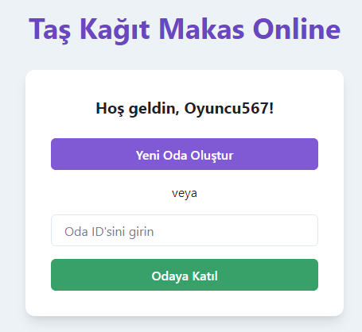
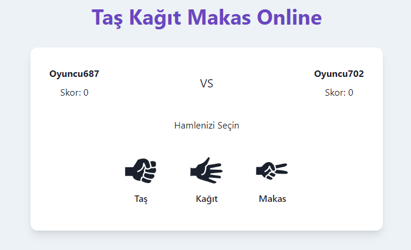

# Rock Paper Scissors Online Game

A real-time multiplayer Rock Paper Scissors game built with React. Challenge your friends or play against random opponents online!

## 🎮 Features

- Real-time multiplayer gameplay
- User-friendly interface
- Score tracking
- Responsive design for all devices
- Simple and intuitive controls

 ## 🎮 Game Screenshots

<div align="center">
  
  
</div>

## 🚀 Live Demo

Soon

## 🛠️ Technologies Used

- React.js
- CSS
- JavaScript
- Socket.IO
- Vite

## 📥 Installation

1. Clone the repository:
```bash
git clone https://github.com/R7flex/RockPaperScissors-Online.git
```

2. Navigate to the project directory:
```bash
cd RockPaperScissors-Online
```

3. Install dependencies:
```bash
npm install
cd frontend
npm install
```

4. Start the development server:
```bash
cd backend
node server.js

cd ..

cd frontend
npm run dev
```

5. Open [http://localhost:5173](http://localhost:5173) in your browser.

## 🎯 How to Play

1. Open the game in your browser
2. Choose your move (Rock, Paper, or Scissors)
3. Wait for your opponent's move
4. The winner is determined by classic Rock Paper Scissors rules:
   - Rock beats Scissors
   - Scissors beats Paper
   - Paper beats Rock

## 🤝 Contributing

Contributions are welcome! Please feel free to submit a Pull Request.

## 📝 License

This project is licensed under the MIT License - see the [LICENSE](LICENSE) file for details.

## 📞 Contact

Discord: refo123_

Project Link: [https://github.com/R7flex/RockPaperScissors-Online](https://github.com/R7flex/RockPaperScissors-Online)
